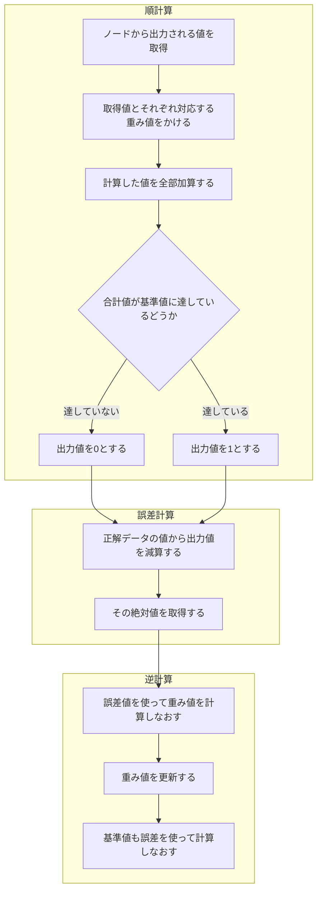

```mermaid
flowchart TD
  subgraph ide1 [順計算]
    A[ノードから出力される値を取得] --> B[取得値とそれぞれ対応する重み値をかける] --> C[計算した値を全部加算する] --> D{合計値が基準値に達しているどうか}
    D -->|達していない| E[出力値を0とする]
    D -->|達している| F[出力値を1とする]
  end
  E & F --> G
  subgraph ide2 [誤差計算]
    G[正解データの値から出力値を減算する] --> H[その絶対値を取得する]
  end
  H --> I
  subgraph ide3 [逆計算]
    I[誤差値を使って重み値を計算しなおす] --> J[重み値を更新する] --> K[基準値も誤差を使って計算しなおす]
  end
```
