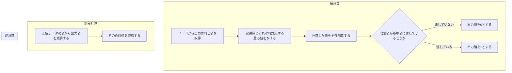

```mermaid
flowchart TB
  subgraph ide1 [順計算]
    A[ノードから出力される値を取得] --> B[取得値とそれぞれ対応する重み値をかける]
    B --> C[計算した値を全部加算する] --> D{合計値が基準値に達しているどうか}
    D -->|達していない| E[出力値を0とする]
    D -->|達している| F[出力値を1とする]
  end
  subgraph ide2 [誤差計算]
    G[正解データの値から出力値を減算する] --> H[その絶対値を取得する]
  end
  subgraph ide3 [逆計算]
  end
```
